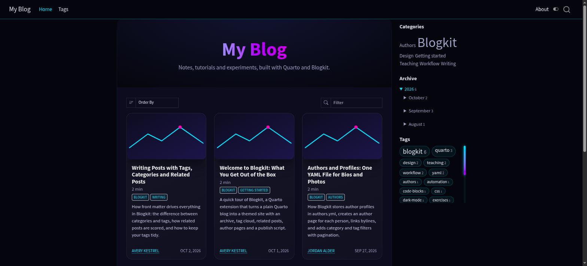
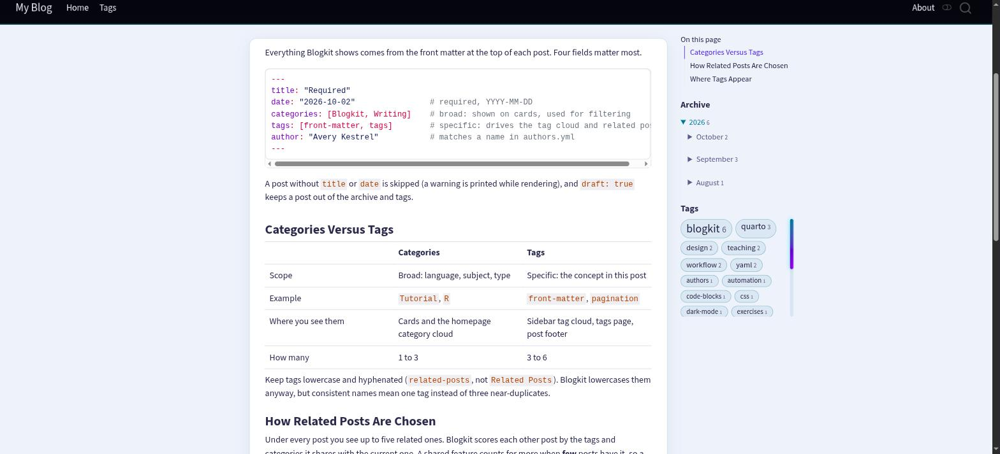

# Blogkit

A Quarto extension and starter site that gives your blog a dark/light theme, tags, related posts and author pages. It needs **no server and no database**.

Repository: <https://github.com/statmania/quarto-blogkit>

| Dark (default) | Light (navbar toggle) |
| :--- | :--- |
|  |  |

## Features

- Dark and light theme with a navbar toggle (dark by default, choice remembered)
- Sidebar archive and tag cloud
- Tags page with pagination, plus a tags row under each post
- Related posts, ranked by shared tags and categories
- Multiple authors: bios and photos in one `authors.yml`, an author page per person, author cards under posts
- Hint and Reveal buttons for exercise posts
- Small-screen "On this page" menu
- `publish.sh`: render, commit and push in one command

When you add a post, render **only that post**. The archive, tags, related posts and author pages update on their own.

## Requirements

- [Quarto](https://quarto.org) 1.9 or newer
- Python 3 and PyYAML: `pip install pyyaml`
- Git (only for `publish.sh`)

## Setup

Choose one of the two options.

### Option A: start a new blog

```bash
mkdir my-blog && cd my-blog
quarto use template statmania/quarto-blogkit
quarto render
```

This gives you a sample site with six posts, two authors, a homepage, an About page and a tags page. Replace the sample posts and authors with your own.

### Option B: add Blogkit to an existing blog

**1. Install the extension**

```bash
quarto add statmania/quarto-blogkit
```

**2. Update `_quarto.yml`**

```yaml
project:
  type: website
  output-dir: docs                                   # or _site
  pre-render: _extensions/blogkit/build_site_data.py
  render:
    - "*.qmd"
    - "posts/*.qmd"
    - "authors/*.qmd"                                # author pages generated from authors.yml

format:
  blogkit-html: default
```

**3. Check these four things**

1. Every post has a `title` and a `date`.
2. `posts/_metadata.yml` contains `toc: true`. The sidebar widgets sit beside the table of contents.
3. `index.qmd` has a listing with `categories: cloud` (copy it from the sample). The homepage sidebar sits next to it.
4. Optional: copy the author file and publish script:
   ```bash
   cp _extensions/blogkit/publish.sh .
   ```
   Then create `authors.yml` (see [Authors](#authors)).

## Write a post

Put posts in `posts/`, for example `posts/my-post.qmd`. The name can also end in `.md`, or be a folder: `posts/my-post/index.qmd`.

```yaml
---
title: "Descriptive Title"
description: "One or two sentences for cards and search."
date: "2026-10-05"
categories: [Tutorial]        # broad topic
tags: [quarto, shell]         # specific; lowercase, hyphenated; drives tags and related posts
author: "Avery Kestrel"       # must match a name in authors.yml
---
```

Add `draft: true` to keep a post out of the archive, tag cloud and related lists.

### Hint and reveal buttons

````markdown
::: {.reveal-code}
::: {.hint}
- Start `i` at 2
- Add 2 each pass
:::

```python
i = 2
while i <= 10:
    print(i, end=" ")
    i += 2
```
:::
````

The code stays hidden until the reader clicks **Reveal code**. **See hint** shows the bullets. Without JavaScript, both are visible.

## Authors

Create `authors.yml` in the project root. Each key becomes the page slug.

```yaml
avery-kestrel:
  name: Avery Kestrel
  aliases: []                         # other spellings used in posts
  image: img/avery-kestrel.svg
  tagline: Writes about workflows
  bio: >-
    A couple of sentences.
  links:
    - {text: Website, href: "https://example.org"}
```

Posts only need `author: "Name"`. Authors not listed in the file are shown without a link.

## Comments

Blogkit does not include comments, because a static site has no server to store them. Quarto has built-in support for third-party comment services. [Giscus](https://giscus.app) is the best fit: it is free, has no ads, and stores comments in your repository's GitHub Discussions.

**1. Prepare the repository**

1. Make the repository public.
2. In **Settings → General → Features**, turn on **Discussions**.
3. Install the [giscus app](https://github.com/apps/giscus) on the repository.
4. Go to <https://giscus.app>, enter your `owner/repo`, and pick a Discussion category (Announcements is a good choice).

**2. Turn it on in `_quarto.yml`**

```yaml
website:
  comments:
    giscus:
      repo: your-user/your-repo
```

Quarto adds the comment box under every page and switches its theme with the dark/light toggle. To limit comments to posts, put the same `comments:` block in `posts/_metadata.yml` instead. To hide them on one page, set `comments: false` in that page's front matter.

**Other options:** Quarto also supports `utterances` (GitHub Issues) and `hypothesis` (annotations on the page). See the [Quarto comments guide](https://quarto.org/docs/websites/website-tools.html#comments) for every setting.

## Publish

```bash
./publish.sh posts/a.qmd             # one post
./publish.sh posts/a.qmd posts/b.qmd # several posts
./publish.sh --all                   # full render after theme or config changes
./publish.sh -m "message" --no-push  # custom commit message, do not push
```

The script renders what you name, commits the project folder, rebases and pushes.

**GitHub Pages:** build into `docs/`, commit it, then set **Settings → Pages** to the `main` branch and the `/docs` folder.

## Options

All options are optional. Put them under a `blogkit:` key in `_quarto.yml`:

```yaml
blogkit:
  posts-dir: posts          # where posts live
  authors-file: authors.yml
  per-page: 10              # pagination on tag and author pages
  related: 5                # related posts under each post
  labels:                   # reword or translate interface text
    archive: Archiv
    tags: Schlagworte
    related: Weitere Beiträge
```

Label keys: `onThisPage`, `archive`, `tags`, `related`, `allCategories`, `allTags`, `category`, `tag`, `pickTag`, `post`, `posts`, `prev`, `next`, `allBy` (uses `{n}` and `{name}`), `of` (uses `{a}` and `{b}`).

## Logo

The starter site ships a **sample logo** (`img/logo.svg`) and shows it in the navbar through `logo:` in `_quarto.yml`. **Replace it with your own**: overwrite `img/logo.svg` (or point `logo:` at a PNG or SVG of your choice). Remove the `logo:` line to show no logo.

```yaml
website:
  navbar:
    logo: img/logo.svg
```

## Theming

Colours are CSS variables (`--bk-bg`, `--bk-text`, `--bk-cyan`, ...) at the top of `_extensions/blogkit/styles.css`. To override them, add your own stylesheet:

```yaml
format:
  blogkit-html:
    css: custom.css
```

Use the variables in your CSS so it works in both themes. Scope light-only rules with `body.quarto-light`.

Quarto decides what counts as "dark" from the dark theme's background colour, so `theme-dark.scss` sets a near-black `$body-bg`.

## How it works

1. Before every render, `build_site_data.py` reads each post's front matter and `authors.yml`. It writes `blogkit-data.js` and `blogkit.js` into the output folder, plus `authors/<slug>.qmd` and (if missing) `tags.qmd`.
2. `site-include.html` loads `blogkit.js` on every page.
3. `blogkit.js` reads `blogkit-data.js` and builds the sidebar, tags, related posts, author cards, tags page and author pages in the browser.

The data is a `.js` file, not JSON, on purpose. Browsers block `fetch()` on pages opened from disk, but a script tag works everywhere.

## Notes and limitations

- Quarto extensions cannot register a pre-render script, so the hook is a line in `_quarto.yml`.
- Sidebar widgets need the margin sidebar. Pages without a table of contents or a category-cloud listing skip them.
- Bylines and author cards depend on Quarto's title-block markup (`.quarto-title-meta-heading`). A Quarto redesign could need a small fix in `blogkit.js`.
- GitHub Pages may cache `blogkit-data.js` for a few minutes after a push.
- `authors/*.qmd` are generated, so do not edit them. Add `authors/` to `.gitignore` if you do not want them committed.
- Related posts ignore features shared by every post, since a tag on all posts says nothing.

## Repository layout

```
_extensions/blogkit/    the extension (copy this folder to use it anywhere)
  _extension.yml        defines the blogkit-html format
  styles.css, theme-dark.scss, code-reveal.html, site-include.html
  blogkit.js            browser script
  build_site_data.py    pre-render hook
  publish.sh
img/logo.svg            sample navbar logo (replace with yours)
posts/, authors.yml, index.qmd, ...   the sample site and starter template
docs/                   the built sample site
```

## License

MIT. See [LICENSE](LICENSE).
